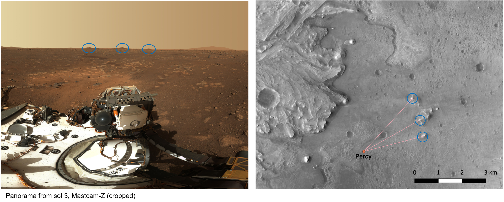

# Landmark-Based-TRN
A plugin for [QGIS](https://www.qgis.org/en/site/) that provides detection and analysis of topographical landmarks for use in ground-level terrain-relative navigation (by planetary rovers). This tool operates on digital elevation maps and provides the following functionality.

 - procedurally detect potential landmarks using terrain morphology
 - compute regions of visibility for these landmarks (using the [Viewshed Analysis](https://plugins.qgis.org/plugins/ViewshedAnalysis/) plugin)
 - compute the theoretical estimator quality for a rover situated at any point in the scene

See the [associated paper](https://russ-stuff.com/wp-content/uploads/2022/01/IEEE_AERO___Landmark_Based_TRN_on_Mars.pdf) for more details and an example analysis of Martian topography data using the tool.


**Note**: this repository is temporary and will soon be deprecated in favor of an official NASA repository (coming soon)


## Navigation Model
The hypothetical model for ground-level TRN works as follows.

- the rover makes bearing measurements to known landmarks by visually identifying them in its field-of-view
- measurements are combined with known rover orientation to obtain globally-registered azimuth estimates
- these estimates have some 0-mean noise with SD given by `pointing_accuracy`
- azimuth estimates to multiple landmarks are combined to give an estimate of rover position

The distance to these landmarks and the stereo baseline between them will affect the theoretical accuracy of this estimate. The available landmarks and resulting uncertainty from a given location can be pre-computed and quantified using [GDOP](https://en.wikipedia.org/wiki/Dilution_of_precision_(navigation)).


## QGIS Algorithms
The following processing algorithms (available from the QGIS processing toolbox after installation) provide the tools for analyzing a scene, allowing us to determine the potential feasibility of this navigation model.

 - `peak_extractor_algorithm`: given a DEM, create a vector layer containing points corresponding to detected peaks (uses GRASS r.param.scale internally)
 - `quality_analyzer_algorithm`: given a DEM, a vector containing landmark positions, and various parameters pertaining to the rover, compute the localization quality metric at every point, returning the resulting raster
 - `path_animation_algorithm`: given a path through the scene, the set of landmarks, their corresponding FIM's (returned as part of `quality_analyzer_algorithm`), and various parameters pertaining to the rover, compute the covariance matrix at every point in the scene, returning a layer with waypoints along the path, a layer with observation rays, and a layer with the covariance ellipses (all timestamped)


### Landmark Detection Process:


### Terrain Landmark Example:



### GDOP Map Example:


## Installation
As prerequisite, first install the [Viewshed Analysis](https://plugins.qgis.org/plugins/ViewshedAnalysis/) plugin. Also install the `affine` python package into your QGIS python environment:

```bash
$ (env) pip install affine
```

Then simply copy the full `terrain_relative_navigation` folder into your `profiles\default\python\plugins` folder within your installation of QGIS. Ex:

```
D:\Users\YOUR_USERNAME\AppData\Roaming\QGIS\QGIS3\profiles\default\python\plugins\terrain_relative_navigation
```
You will then have to restart QGIS and enable the plugin through `Plugins > Manage and Install Plugins`.


## Acknowledgment
The research/development was carried out at the Jet Propulsion Laboratory, California Institute of Technology, under a contract
with the National Aeronautics and Space Administration
(80NM0018D0004)
